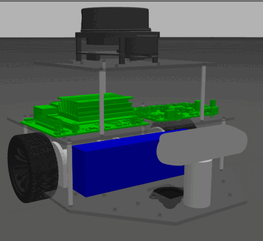
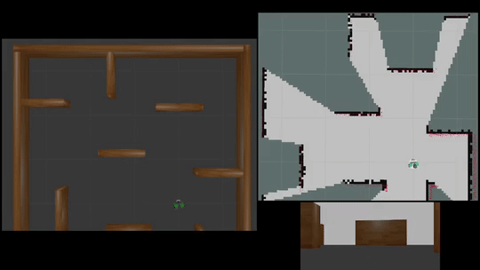
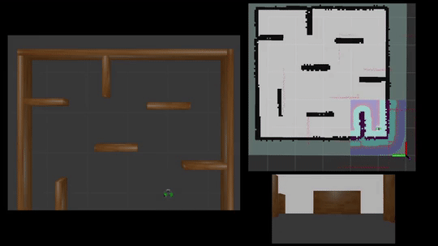

# LilyBot — Autonomous Differential-Drive Mobile Robot

<table>
<tr>
<td>
<b>LilyBot</b> is a two-wheeled autonomous differential-drive mobile robot. It is equipped with an Intel RealSense D435i depth camera, YDLIDAR X4 2D Lidar, a Yahboom ROS Robot Expansion Board, and powered by a Jetson Nano B01 running Ubuntu 20.04 with ROS 1 (Noetic) middleware. These components make LilyBot a versatile platform for indoor AI-based tasks such as Active SLAM, Smart Navigation, and End-to-End Navigation. This repository contains a digital twin of the physical robot, with all component masses and inertias accurately modeled, enabling training and testing of AI models in simulation with robot behavior closely matching that of the real robot.
</td>
<td>
<p align="left">
  
</p>
</td>
</tr>
</table>

| Real Robot | SolidWorks| RViz | Gazebo |
|:-------:|:-------:|:-------:|:-------:|
|||||

## Table of Contents
- [Requirements](#requirements)
- [Installation Guide](#installation-guide)
- [Usage](#usage)
- [Part List](#part-list)
- [References](#references)
- [Authors](#authors)
---

## Requirements

### ROS & Simulator
- [ROS Noetic](https://wiki.ros.org/noetic/Installation)  
- [Gazebo Simulator](https://classic.gazebosim.org/download)  

### ROS Packages
- [Realsense2 Camera](https://wiki.ros.org/realsense2_camera)
- [Teleop Twist Keyboard](https://wiki.ros.org/teleop_twist_keyboard)

## Installation Guide

First, install the required packages using the following commands:

```console
sudo apt-get install ros-noetic-teleop-twist-keyboard
sudo apt-get install ros-noetic-realsense2-description
```

Then, clone this repository inside your ROS workspace by executing the following commands : 

```console
cd <your_workspace_directory>/src
git clone https://github.com/RAI-Techno/lilybot.git
cd ..
catkin_make
source devel/setup.bash
```

## Usage

1. **Manually control the robot (robot + teleop twist keyboard)**  
```bash
roslaunch lily_bot lily_go.launch
```

2. **Build a map with SLAM (robot + slam_gmapping)**
```bash
roslaunch lily_bot lily_slam.launch
```

save the map after mapping:
```bash
rosrun map_server map_saver
```

<p align="center">
  <a href="https://youtu.be/OeNYcNins9g" target="_blank">
    
  </a>
</p>

3. **Navigate using a saved map (robot + AMCL + move_base)**
```bash
roslaunch lily_bot lily_nav.launch
```

<p align="center">
  <a href="https://youtu.be/QLn8p-eGrxw" target="_blank">
    
  </a>
</p>

## Part List

| Part                    | Info |
|:------------------------|:---------------------------------------------------------------------------:|
| Jetson NANO B01(4GB SUB) | [Yahboom.net](https://www.yahboom.net/study/jetson-nano), [Yahboom.net](https://www.yahboom.net/study/jetson-nano-2) |
| Intel® RealSense™ Depth Camera D435i | [Realsenseai.com](https://realsenseai.com/stereo-depth-cameras/depth-camera-d435i/) |
| YDLIDAR X4 2D Lidar | [Ydlidar.com](https://www.ydlidar.com/product/ydlidar-x4-pro) |
| ROS Robot Expansion Board | [Yahboom.net](https://www.yahboom.net/study/ROS-Driver-Board) |
| Lipo Battery (11.1V 4200mAh 40C) | [Robotzade.com](https://www.robotzade.com/urun/11-1v-4200mah-40c-lipo-batarya-3s-pil) |
| DC Motor | [Dfrobot.com](https://www.dfrobot.com/product-1462.html) |

## References

This work relies on prior open-source contributions. We gratefully acknowledge the following projects:

- **[SolidWorks to URDF Exporter](https://wiki.ros.org/sw_urdf_exporter)**
- **[Pal-Robotics-Forks](https://github.com/pal-robotics-forks/realsense/)**
- **[Ubuntu 20.04 for Jetson Nano](https://github.com/Qengineering/Jetson-Nano-Ubuntu-20-image)**

## Authors

- [Ali Hasan](https://github.com/Ali-Hasan-617)  
- [Bashar Moalla](https://github.com/basharmoalla)  
- [Yousef Mahfoud](https://github.com/yousef4422)
